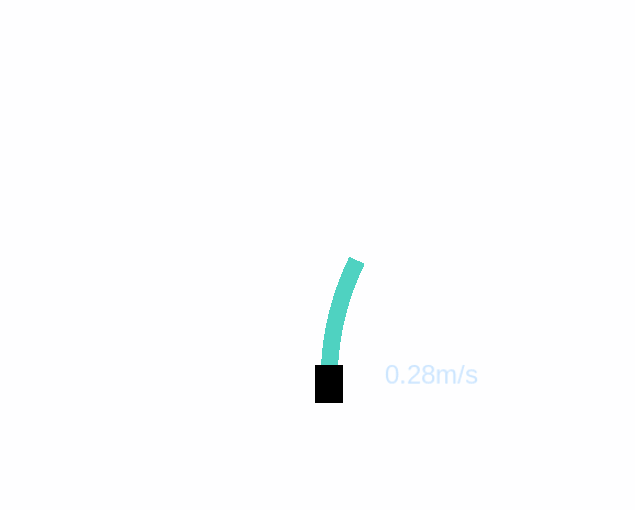

# Info

``` c
wheeltec@wheeltec:$  lsb_release -a
No LSB modules are available.
Distributor ID: Ubuntu
Description:    Ubuntu 18.04.5 LTS
Release:        18.04
Codename:       bionic
```


## Wheeltec robot

angle: between -180 to 180 degrees

``` c
rostopic echo /scan -n1
header:
  seq: 2330
  stamp:
    secs: 1674830081
    nsecs: 952494816
  frame_id: "laser"
angle_min: -3.14159274101
angle_max: 3.14159274101
angle_increment: 0.0140563426539
time_increment: 0.000220297471969
scan_time: 0.0984729677439
range_min: 0.300000011921
range_max: 100.0
ranges: [7.5320000648498535, 7.5320000648498535, 7.5320000648498535, .....]
intensities: [130.0, 174.0, 160.0, ....]
---
```

## Simulator 

angle: between -45 to 225 degrees

``` c
rostopic echo /scan -n1
header:
  seq: 0
  stamp:
    secs: 215
    nsecs: 374000000
  frame_id: "laser"
angle_min: -2.3561899662
angle_max: 2.3561899662
angle_increment: 0.00436331471428
time_increment: 0.0
scan_time: 0.0
range_min: 0.10000000149
range_max: 10.0
ranges: [2.2399001121520996, 2.2156128883361816, 2.2194812297821045, ....]
intensities: [0.0, 0.0, 0.0, .....]
---


```



