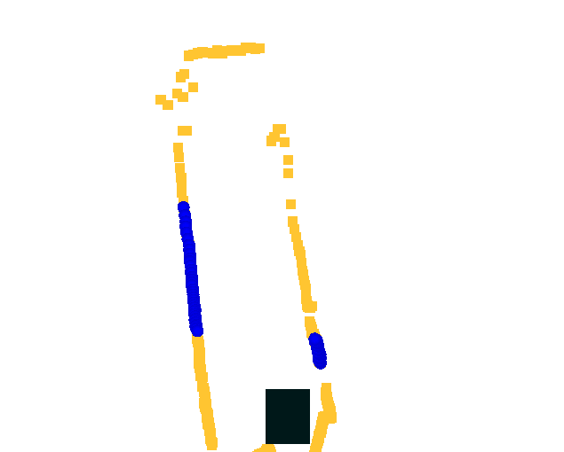
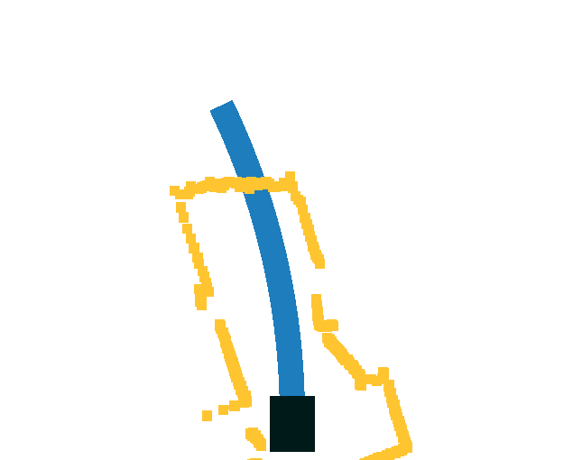
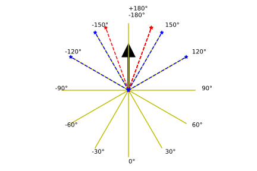
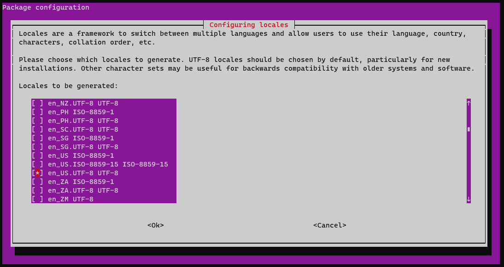
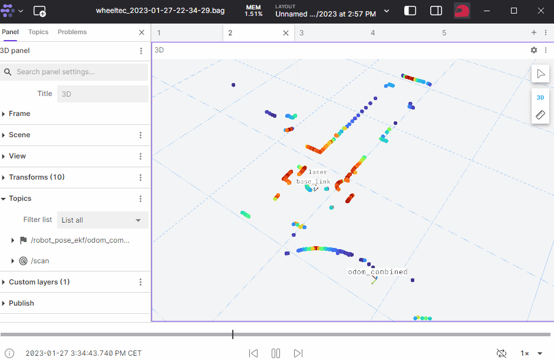

# Workshop

- A small overview of the `Bavarian-Hungarian Self-driving vehicles` workshop.
- **Date**: 2023.11.03. 
- **Place**: Győr, Hungary.

# `megoldas_zala23` ROS 1 package
🤖 In the following a very simple wall/gap following approach will be presented and described. The origin of he code is based on the work of Suresh Babu (University of Virginia, [license](https://github.com/linklab-uva/f1tenth_gtc_tutorial/blob/master/LICENSE)). Link to the original code: [github.com/linklab-uva/f1tenth_gtc_tutorial](https://github.com/linklab-uva/f1tenth_gtc_tutorial).

The name of the package is a comes from a hungarian expression (`megoldas`: solution / Lösung).

# The robot used in the competition
Wheeltec / Roboworks Rosbot mini Ackermann robot


On-board computer
- Nvidia Jetson Nano

Sensors
- Orbbec Depth Camera
- LSN10 LIDAR


# Video 

<iframe width="560" height="315" src="https://www.youtube.com/embed/-PStmHQlJaU?si=eOFQazJ38qJyHe2u" title="YouTube video player" frameborder="0" allow="accelerometer; autoplay; clipboard-write; encrypted-media; gyroscope; picture-in-picture; web-share" allowfullscreen></iframe>

# Usage
Prerequisites:
- WiFi-enabled computer with Ubuntu 18.04 / 20.04 operating system and ROS Melodic / Noetic installation
- Internet access (Ethernet cable or WiFi)

1. Turn on the robot platform.
2. Use the computer to connect to the WiFi network created by the robot. The name of the WiFi network is unique for each robot platform, the `#` at the end of the SSID changes according to the number of the robot platform:
```
SSID: WHEELTEC_CAR_5.5_#
Password: dongguan
```
3. Use SSH to connect to the on-board computer of the robot platform with the following terminal command:
```
ssh wheeltec@192.168.0.100
```
A password will be required, the default password is `dongguan`

## Internet access on the robot platform

Software packages can be downloaded to the on-board computer of the robot platform, which requires internet access.

- Ethernet: connect the Ethernet cable to the Ethernet port of the on-board computer of the robot platform.
- WiFi: after issuing the `nmtui` terminal command, connect to the available WiFi network.
```
nmtui
```


## Install the `ROS 1` package

After installation, the functions of the robot platform can be accessed using ROS. The sample solution of the competition can also be deployed by ROS.

Create a workspace and install the sample solution on the robot:

``` bash
mkdir -p ~/workshop_ws/src
```

``` bash
cd ~/workshop_ws/
```

``` bash
catkin init
```

``` bash
cd ~/workshop_ws/src/
```

``` bash
git clone https://github.com/robotverseny/megoldas_zala23
```

``` bash
cd ~/workshop_ws/
```

``` bash
catkin build megoldas_zala23
```

``` bash
echo "source /home/wheeltec/workshop_ws/devel/setup.bash" >> ~/.bashrc
```

``` bash
source ~/.bashrc
```

Install `screen`
``` bash
sudo apt install mc screen
```

Install jks visualization rviz plugin: depending on ROS 1 version (**melodic** / **noetic**):

``` bash
sudo apt install ros-melodic-jsk-rviz-plugins
```

``` bash
sudo apt install ros-noetic-jsk-rviz-plugins
```

# Usage

## Start solution using screen (recommended)

The script `verseny_start.sh` sets the required environmental variables, starts the ROS nodes and finally after *2 minutes* **stops** everything. Have a look at the code: [verseny_start.sh](https://github.com/robotverseny/megoldas_zala23/blob/main/etc/verseny_start.sh) 

```
rosrun megoldas_zala23 verseny_start.sh
```

The `verseny_start.sh` shell script usually launches several virtual terminals, such as: `roscore`, `turn_on_wheeltec_robot`, `lsn10_lidar`, `megoldas1.launch`. All components of the solution can be stopped with the following command:
```
rosrun megoldas_zala23 stop_all.sh
```

Further commands:

- list screen: `screen -ls`
- restore screen: `screen -r roscore` / `screen -r turn_on_wheeltec_robot` / `screen -r megoldas1`
- detach: `Ctrl-a` + `Ctrl-d`

# ROS connection

The ROS topics advertised by the robot platform are also available on the computer connected to the platform, with the appropriate setting of the `ROS_MASTER_URI` variable:
``` r
export ROS_MASTER_URI=http://192.168.0.100:11311
```
After the appropriate setting of the variable, the topics can be listed and visualized using Rviz:
```
rostopic list
```
```
rosrun rviz rviz
```
# Some explanatory animations 
```
roslaunch megoldas_zala23 rviz1.launch
```





## Start solution per component

The solution can also be started per component, not just as a single shell script. This requires four terminal windows on the on-board computer of the robot platform and issuing the following commands per terminal:

``` bash
roscore
```

``` bash
roslaunch turn_on_wheeltec_robot turn_on_wheeltec_robot.launch
```

``` bash
roslaunch lsn10 lsn10.launch
```

``` bash
roslaunch megoldas_zala23 megoldas1.launch
```

# Additional information

## Workspaces
```
~/wheeltec_robot/src
~/catkin_workspace/src
~/workshop_ws/src/
```


## Topic management

```
rostopic hz /scan
rostopic echo /scan -n1
rostopic type /scan
```

```
sensor_msgs/LaserScan
```

## Robot platform language settings
```
sudo dpkg-reconfigure locales
```



**reboot**

## Rosbag management
```
cd ~/rosbags
rosbag record -a -o test1
```
```
rsync -avzh --progress wheeltec@192.168.0.100:/home/wheeltec/rosbags/ /mnt/c/bag/wheeltec/
rosbag info test1_2023-03-30-12-37-22.bag
rosbag play test1_2023-03-30-12-37-22.bag
```

You can even visualize rosbags in [Foxglove studio](https://foxglove.dev/):



[Download rosbags](https://drive.google.com/drive/folders/1CAh-EIHjlvURHi62bxNnC9pIxUP5A00K?usp=drive_link)

- [Further explanation ipynotebook](https://github.com/robotverseny/megoldas_zala23/blob/main/etc/explain.ipynb)
- [Competition homepage](https://robotverseny.github.io/)
- [Foxglove studio](https://foxglove.dev/)